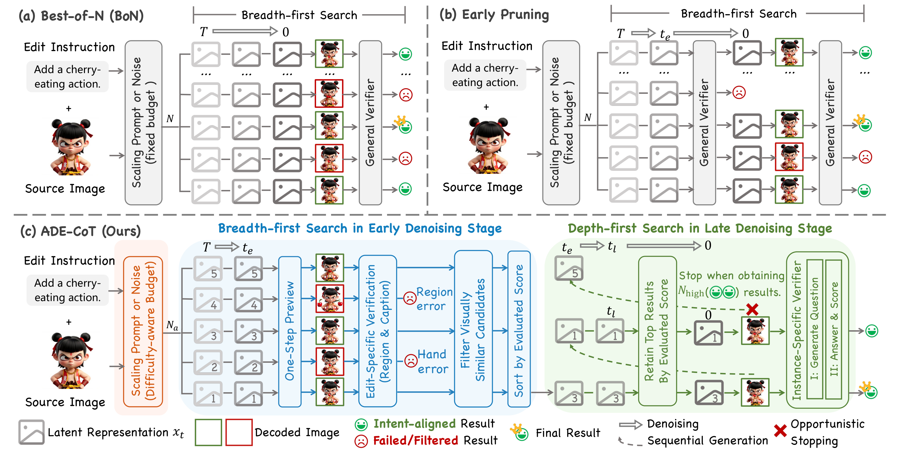

# ADE-CoT — From Scale to Speed: Adaptive Test-Time Scaling for Image Editing

<p align="center">
  <a href="https://arxiv.org/abs/2603.00141"></a>
  
</p>

<p align="center">
  <a href="https://arxiv.org/abs/2603.00141"><b>Paper</b></a> |
  <a href="https://github.com/AMAP-ML/ADE-CoT"><b>Code</b></a>
</p>

> Official demo implementation of **ADaptive Edit-CoT (ADE-CoT)**, an on-demand test-time-scaling framework for instruction-driven image editing, accepted at **CVPR 2026**.
>
> ADE-CoT shifts the focus of Image-CoT from "scale" to "speed". Instead of paying a fixed Best-of-N cost on every edit, it (i) **dynamically allocates** the sampling budget to harder cases, (ii) **prunes early** with edit-specific verifiers, and (iii) **stops opportunistically** once enough intent-aligned results are obtained — yielding **> 2× speed-up over Best-of-N at comparable / better quality**.

**News:** ADE-CoT has been accepted to CVPR 2026, and the official implementation is now open-sourced. 🎉

<p align="center">
  
</p>

<p align="center">
  <b>Figure 3.</b> Pipeline comparison of Image-CoT methods for editing. <b>(a) Best-of-N</b> uses a breadth-first search with a fixed budget; <b>(b) Early pruning</b> prunes with general MLLM scores; <b>(c) ADE-CoT (Ours)</b> combines difficulty-aware budget allocation, edit-specific verification in the early denoising stage, and depth-first opportunistic stopping in the late denoising stage.
</p>


---

## 🔧 Installation

### 1. Python environment

```bash
git clone https://github.com/AMAP-ML/ADE-CoT.git
cd ADE-CoT

conda create -n ade-cot python=3.10 -y
conda activate ade-cot

pip install -r requirements.txt
```

> **GPU notes.** The demo is tested with **PyTorch 2.5 + CUDA 12.1** on H20. The pinned `torchvision==0.20.1+cu121` requires a matching `torch==2.5.x`; install it from [pytorch.org](https://pytorch.org/) first if pip cannot resolve it automatically.

### 2. (Optional) Per-backbone extra dependencies

| Backbone | Extra requirements |
| --- | --- |
| Step1X-Edit  | `edit_model/Step1X_Edit/requirements.txt` |
| FLUX-Kontext | included in the top-level `requirements.txt` (uses `diffusers`) |

### 3. Configure your MLLM API keys 🔑

All verifier scoring (general `S_gen`, instance-specific `S_spec`, instruction caption for `S_cap`) is performed by external MLLM APIs. **All hard-coded keys have been removed from the codebase** — please configure them as environment variables before running:

```bash
# Required if you use any GPT-* backbone (gpt4o / gpt4.1)
export OPENAI_API_KEY="sk-..."
# Optional — override the endpoint (default: https://api.openai.com/v1/chat/completions)
export OPENAI_API_BASE="https://api.openai.com/v1/chat/completions"

# Required if you use any Qwen-VL backbone (qwen-vl-max / qwen3-vl-plus / ...)
# Multiple keys can be comma-separated to enable automatic key rotation on rate limits.
export DASHSCOPE_API_KEY="sk-...,sk-..."
# Optional — override the DashScope endpoint
export DASHSCOPE_API_BASE="https://dashscope.aliyuncs.com/compatible-mode/v1/chat/completions"
```

You can persist these in a local `.env` file (already git-ignored), or in your shell rc-file. **Never commit keys to the repository.**

The default `--global_score_backbone` / `--instance_specific_backbone` in the paper is `qwen-vl-max`; ADE-CoT is also robust to other Qwen-VL series and GPT-4 series — see Tab. 5 of the paper.

### 4. Download model checkpoints

| Backbone | Download | Place it in `<model_path>/` |
| --- | --- | --- |
| Step1X-Edit    | <https://huggingface.co/stepfun-ai/Step1X-Edit>               | `step1x-edit-i1258.safetensors` + `vae.safetensors` + `Qwen2.5-VL-7B-Instruct/` |
| FLUX.1-Kontext | <https://huggingface.co/black-forest-labs/FLUX.1-Kontext-dev> | any local diffusers-format directory |

Pass the path through `--model_path` when launching the demo.

---

## 🚀 Quick start

### Input JSON format

The demo iterates over a JSON file mapping `<input_image_path> → metadata`:

```json
{
  "examples/case1.png": {
    "instruction":      "Add a cherry eating action.",
    "original_caption": "A character standing with empty hands.",
    "edited_caption":   "A character eating a cherry."
  }
}
```

- `instruction` (required) — the natural-language edit instruction.
- `original_caption` / `edited_caption` (optional) — only needed when `--prune_score_way` contains `caption` (corresponds to `S_cap`).
- `mask_path` (optional) — only needed when `--prune_score_way` contains `region` (corresponds to `S_reg`).
- `instance_specific_questions` (optional) — pre-generated 5-question yes/no CoT checklist. If missing, ADE-CoT will auto-generate one via the MLLM (Sec. 3.3) and cache it back into the JSON.

### Minimal run — Best-of-N baseline (no ADE-CoT)

```bash
torchrun --nproc_per_node=1 ADE_CoT_demo.py \
    --input_json_dir   ./examples/demo.json \
    --output_dir       ./output \
    --model_name       step1x_edit \
    --model_path       /path/to/Step1X-Edit \
    --num_samples      32 \
    --try_times        1 \
    --seed             42
```

### Full ADE-CoT (all three strategies enabled)

```bash
# Paper defaults: t_e=8 and t_l=16
torchrun --nproc_per_node=1 ADE_CoT_demo.py \
    --input_json_dir   ./examples/demo.json \
    --output_dir       ./output \
    --model_name       flux_kontext \
    --model_path       /path/to/FLUX.1-Kontext-dev \
    --num_samples      32 \
    --try_times        3 \
    --num_early_steps  8 \
    --num_late_steps  16 \
    --early_stop_strategy        adaptive_TTS_nums-early_prune_rank-adaptive_stop \
    --prune_score_way            vie-caption-region \
    --retain_score_way           vie-caption-region \
    --high_confidence_score_way  semantic_overall_specific \
    --final_score_aggregate_way  vie-specific \
    --global_score_backbone      qwen-vl-max \
    --instance_specific_backbone qwen-vl-max
```

### Switching backbones

```bash
# Step1X-Edit
--model_name step1x_edit  --model_path /path/to/Step1X-Edit

# FLUX.1 Kontext
--model_name flux_kontext --model_path /path/to/FLUX.1-Kontext-dev
```

---

## 📊 Output structure

For each input image, the demo writes:

```
<output_dir>/<model_name>/<image_name>/
├── final_image/              # All final candidates, named by seed
├── xt_to_x0/                 # One-step x_0 previews at t_e and t_l
├── pt_output/                # Optional latent dumps (off by default)
└── log.txt                   # Per-case log: instruction, scores, selected seed, ...
```

The selected best candidate per `try_times` experiment is logged inside `log.txt` as `select_task_key`, together with its final GPT-4-rated VIE-Score.

---

## 🙏 Acknowledgements

ADE-CoT builds upon and is grateful to:

- **[Step1X-Edit](https://github.com/stepfun-ai/Step1X-Edit)** (StepFun-AI) — base instruction editor.
- **[FLUX.1 Kontext](https://github.com/black-forest-labs/flux)** (Black Forest Labs) — context-aware editor.
- **[BAGEL](https://github.com/ByteDance-Seed/Bagel)** (ByteDance) — unified understanding-and-generation editor (used in the paper, not packaged in this release).
- **[VIE-Score](https://github.com/TIGER-AI-Lab/VIEScore)** (TIGER-Lab) — the general score `S_gen`.
- **[Grounded-SAM 2](https://github.com/IDEA-Research/Grounded-SAM-2)** — region mask extraction for `S_reg`.
- **[CLIP](https://github.com/openai/CLIP)** & **[DINOv2](https://github.com/facebookresearch/dinov2)** — feature spaces for `S_cap` and the similarity filter.
- The HuggingFace **diffusers** team and the **kohya_ss** trainer authors whose code lives under `edit_model/Step1X_Edit/library/`.

Original licenses of each sub-model are preserved under `edit_model/*/LICENSE`.

---

## 📜 Citation

If you find ADE-CoT useful, please cite our paper:

```bibtex
@inproceedings{ADE_CoT,
  title     = {From Scale to Speed: Adaptive Test-Time Scaling for Image Editing},
  author    = {Xiangyan Qu and
               Zhenlong Yuan and
               Jing Tang and
               Rui Chen and
               Datao Tang and
               Meng Yu and
               Lei Sun and
               Yancheng Bai and
               Xiangxiang Chu and
               Gaopeng Gou and
               Gang Xiong and
               Yujun Cai},
  booktitle = {Proceedings of the IEEE/CVF Conference on Computer Vision and Pattern Recognition (CVPR)},
  year      = {2026},
  url       = {https://arxiv.org/abs/2603.00141},
  eprint    = {2603.00141},
  archivePrefix = {arXiv},
  primaryClass  = {cs.CV}
}
```

---

## 📮 Contact

Issues and pull requests are very welcome. For private questions, please open a GitHub discussion.
